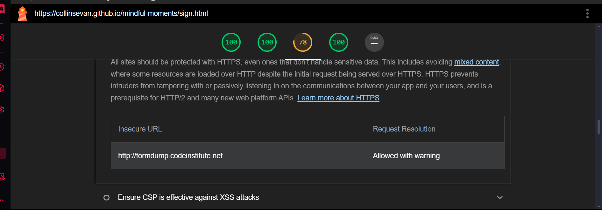
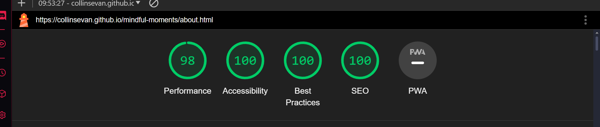
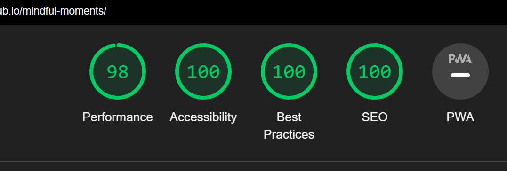
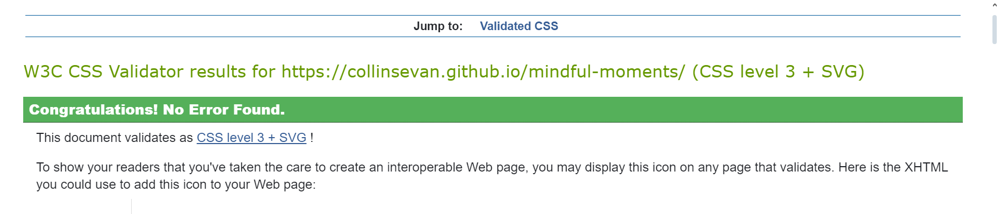
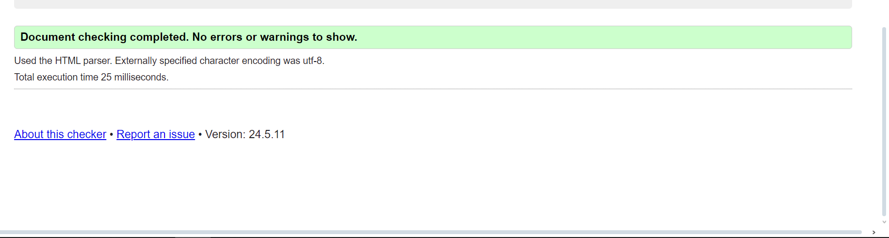

# Mindful Moments - Your Path to Serenity 🧘‍♂️

[View the live project here →]([https://collinsevan.github.io/mindful-moments/])

---

### Discover Inner Peace and Cultivate Mindfulness

Mindful Moments is a website designed to introduce you to the transformative power of mindfulness and meditation. Through guided practices and educational resources, we aim to help you reduce stress, improve mental well-being, and cultivate a deeper connection with yourself.

## Table of Contents

- [User Experience (UX)](#user-experience-ux)
- [Features](#existing-features)
- [Design Language](#design-language)
- [Technologies](#technologies)
- [Testing](#testing)
- [Deployment](#deployment)

## User Experience (UX)

### User Stories

- **First-time visitor:**
    - Immediately understand the focus on mindfulness and meditation through a visually engaging hero section.
    - Quickly grasp the benefits of mindfulness and meditation presented in a clear and concise way.
    - Easily locate the sign-up form to express interest in guided meditation classes.
- **Returning visitor:**
    - Effortlessly navigate to the sign-up form or explore further information.
    - Access additional resources, such as the introductory meditation video, for continued practice.
    - Enjoy a seamless experience across different devices due to the responsive design.

## Features

### Existing Features

- **Navigation Bar:** Streamlined navigation for easy access to all sections of the website.
- **Hero Section:** Visually captivating introduction to mindfulness and meditation, featuring an inspiring image and text.
- **Benefits Section:** Comprehensive overview of the physical, mental, social, and spiritual benefits of mindfulness and meditation.
- **Sign-up Form:** User-friendly form for collecting contact information from individuals interested in guided meditation classes.
- **Meditation Video Section:** Direct link to an external resource for a guided meditation practice.
- **Footer:** Provides social media links for further engagement and connection.

### Future Features

- **Interactive Class Schedule:** Allow users to browse and register for specific classes directly on the website.
- **Personalized Practice Recommendations:** Tailor suggestions for meditation practices based on individual preferences and needs.
- **Community Forum:** Create a platform for users to connect, share experiences, and support each other in their mindfulness journey.

### Typography

- **Font Family:** Roboto Condensed for headings and body text, providing a modern and clean aesthetic.
- **Font Size:** Varied sizes for different elements to establish a clear visual hierarchy and improve readability.
- **Font Weight:** Strategic use of font weights (e.g., 650 for the logo) to emphasize key elements.

### Colors

- **Background:** Primarily dark green (#2E4129) and light green (#3A5435) to create a calming and natural atmosphere.
- **Text:** Predominantly white to ensure optimal contrast and readability against the dark background.
- **Accents:** Blue used for hover effects on links, adding subtle interactivity.

### Responsive Design

- The website is designed to adapt to various screen sizes and devices, ensuring a positive user experience across desktops, tablets, and mobile phones.
- The navigation bar transforms into a hamburger menu on smaller screens to maintain a clean and uncluttered layout.

## Technologies Used

- **HTML5:** Provides the structural foundation of the website.
- **CSS3:** Enables the styling and layout of the website's visual elements.
- **Font Awesome:** Used to incorporate icons for visual enhancement.
- **Google Fonts:** Provides the Roboto Condensed and Crimson Pro fonts for a unique typographic style.

## Testing

- The site has been tested with lighthouse. The only issue is with the formdump provided. It does not have https protocol so the best practices score is 78 on sign up page. 
- All links have been tested and are functional.

### Validation

- HTML and CSS code has been validated to ensure compliance with web standards and best practices.

### Browser Compatibility

- Tested for compatibility with major browsers, including Chrome, Safari, and Firefox.
- Responsive design tested across different screen sizes and devices.

## Deployment

### How the site was deployed

- From the Github repository, I set up Github pages from the main branch.
- The website is currently deployed at [https://collinsevan.github.io/mindful-moments/index.html]

## Credits

- I took inspiration from code institutes and Ana greaves love running project for the cover text and benefits but put my spin on it by using a center image and a grid layout. [https://github.com/Code-Institute-Org/love-running-2.0]

- I used a meditation video from the 'Great Meditaion' channel on youtube. [https://www.youtube.com/embed/ssss7V1_eyA]

---

**Note:** This README focuses on the front-end aspects of the Mindful Moments website as observed in the provided HTML and CSS.
